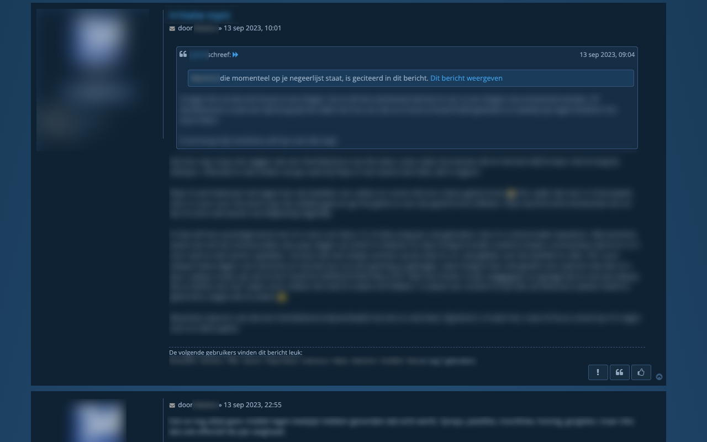

# Blauwwit.be

Dit is een extensie ontwikkeld via  [Plasmo](https://docs.plasmo.com/) voor gebruik op het phpBB forum van [blauwwit.be](blauwwit.be)

Features:

- Toont de negeerlijst in het extensievenster
- Verbergt citaten van gebruikers op je negeerlijst in het forum

**Chrome**

https://chrome.google.com/webstore/detail/blauwwitbe/mncchmkepljefbngibhlpjbkpnacbcmg?hl=en&authuser=0

**Firefox**

https://addons.mozilla.org/en-GB/firefox/addon/blauwwit-be/

**Safari**

Safari is niet voorzien, ook al is dit technisch mogelijk. Apple heeft het heel moeilijk gemaakt sinds enkele jaren om extensie buiten de App Store te distribueren.
Aangezien hiervoor een betaalde Developer account nodig is, wordt Safari niet ondersteund.

**iOS/Android**

Om de extensie op mobile te gebruiken kan je voor iOS de browser [url= https://apps.apple.com/nl/app/orion-browser-by-kagi/id1484498200?l=en-GB ]Orion[/url] gebruiken.
Op op Android kan je [url= https://play.google.com/store/apps/details?id=com.yandex.browser&hl=en]Yandex[/url] gebruiken. 

Deze browsers laten Chrome extensions toe.

