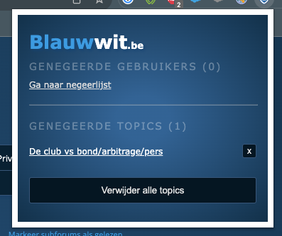
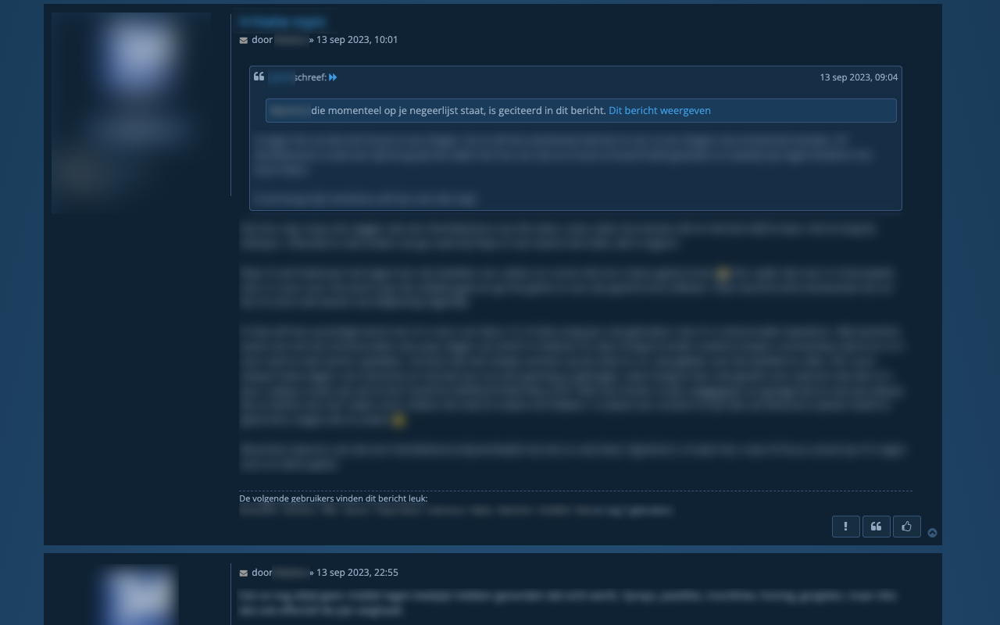
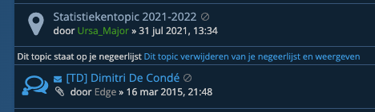

# Blauwwit.be

Dit is een extensie ontwikkeld via  [Plasmo](https://docs.plasmo.com/) voor gebruik op het phpBB forum van [blauwwit.be](blauwwit.be)

## Features

- De gebruikers van je negeerlijst tonen in het extensievenster
- Citaten van gebruikers op je negeerlijst worden verborgen net zoals bij posts.
- Je kan nu ook topics verbergen en deze worden ook het extensievenster weergegeven. Deze topics worden opgeslgen in de sycn storage van je browser, deze zouden dus verborgen moeten zijn op andere plaatsen waar je dezelfde browser met dezelfde Chrome/Firefox account gebruikt.

## Compatibiliteit

**Chrome**

**Firefox**

**Safari**

Safari is niet ondersteund. Apple heeft het heel moeilijk gemaakt sinds enkele jaren om extensie buiten de App Store te distribueren en bovendien moet ge een betaalde Developer account hebben.

**iOS/Android**

Om de extensie op mobile te gebruiken kan je een browser installeren die met Chrome extensions om kan gaan:
- Op iOS kan je de browser [Orion](https://apps.apple.com/nl/app/orion-browser-by-kagi/id1484498200?l=en-GB) gebruiken.\
- Op Android kan je [Yandex](https://play.google.com/store/apps/details?id=com.yandex.browser&hl=en) gebruiken.

## Screenshots

